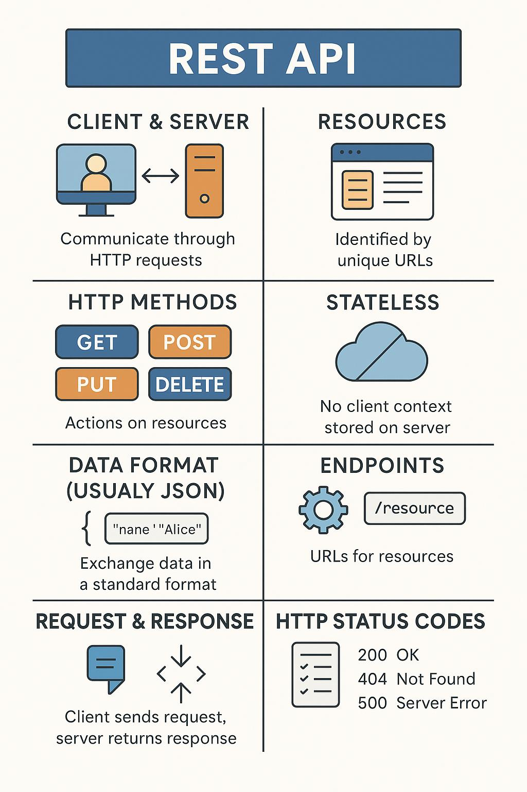

# REST API - A Beginner's Guide

## What is a REST API?
A REST API (Representational State Transfer - Application Programming Interface) is a way for software systems to communicate over the internet using HTTP methods.

---

## Key Concepts

### 1. Client & Server
- **Client**: Frontend (e.g., browser, app)
- **Server**: Backend (e.g., database or service)

### 2. Resources
- Data entities like users, posts, products.
- Accessed via unique URLs (endpoints), e.g., `/users/1`.

### 3. HTTP Methods
| Method | Action           | Example                    |
|--------|------------------|----------------------------|
| GET    | Retrieve data    | GET `/users`               |
| POST   | Create data      | POST `/users`              |
| PUT    | Update data      | PUT `/users/1`             |
| DELETE | Delete data      | DELETE `/users/1`          |

### 4. Stateless
- Each request is independent; server stores no session data.

### 5. Data Format
- JSON is commonly used to send/receive data.
```json
{ "name": "Alice", "email": "alice@example.com" }
```

### 6. Endpoints
- URL paths to resources: `/tasks`, `/users/5`, etc.

### 7. Request & Response
- Client sends request → Server sends back data + status code.

### 8. HTTP Status Codes
| Code | Meaning         |
|------|-----------------|
| 200  | OK              |
| 201  | Created         |
| 400  | Bad Request     |
| 401  | Unauthorized    |
| 404  | Not Found       |
| 500  | Server Error    |

### 9. CRUD Operations
| CRUD     | REST Method |
|----------|-------------|
| Create   | POST        |
| Read     | GET         |
| Update   | PUT         |
| Delete   | DELETE      |

---

## Example: To-Do App Endpoints

| Action           | Method | URL         |
|------------------|--------|-------------|
| Get all tasks    | GET    | `/tasks`    |
| Add new task     | POST   | `/tasks`    |
| Get a task       | GET    | `/tasks/1`  |
| Update a task    | PUT    | `/tasks/1`  |
| Delete a task    | DELETE | `/tasks/1`  |

## Basic rules to follow at the end
1. If we know that client -> Browser (always render HTML data)(SSR - Server Side Rendering)
2. If client -> Mobile app (raw data will be sent in JSON) (CSR - Client Side Rendering)
3. Respect http methods

<br>
